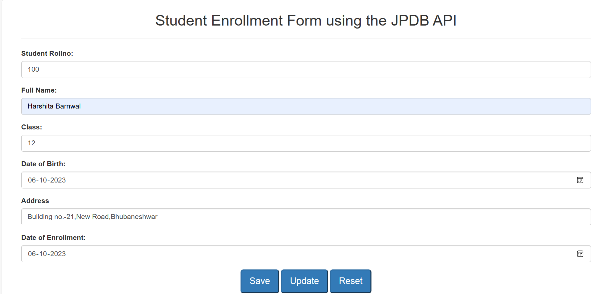

# Student Enrollment Form - README

## Description

This project implements a Student Enrollment Form that allows users to enter and manage student data, which is stored in the SCHOOL-DB database. The form follows specific behavior based on the primary key, Roll No., as described below:

- On page load or control button click, an empty form is displayed with the cursor at the Roll No. input field, and all other fields and buttons are disabled.

- If the Roll No. value does NOT exist in the database, the [Save] and [Reset] buttons are enabled, and the cursor moves to the next field, allowing the user to enter data.

- Data entered in the form must be valid, i.e., no empty fields are allowed.

- After completing the data entry, clicking the [Save] button stores the data in the database and resets the form.

- If the Roll No. value exists in the database, the form displays the existing data, enables the [Update] and [Reset] buttons, and allows users to modify other fields while keeping the Roll No. field disabled.

- Data entered or modified in the form must be valid.

- Clicking the [Update] button updates the data in the database and resets the form.

- The [Reset] button resets the form as per step-2.

## Input Fields

- **Roll No. (Primary Key):** This field uniquely identifies each student.
- **Full Name:** Enter the student's full name.
- **Class:** Specify the student's class.
- **Birth Date:** Provide the student's date of birth.
- **Address:** Enter the student's address.
- **Enrollment Date:** Enter the date of enrollment.

## Control Buttons

- **[Save]:** Used to save new data or update existing data in the database.
- **[Update]:** Used to update existing data in the database.
- **[Reset]:** Used to reset the form to its initial state.

## Project Status

This project is currently in development, implementing the described behavior for the Student Enrollment Form. Additional features and enhancements are planned for future releases.

## Sources

- [JsonPowerDB Official Documentation](https://jsonpowerdb.com/)

## Benefits of using JsonPowerDB

- Lightning-fast performance
- Easy to set up and use
- Schema-less data storage
- Real-time data processing
- Multi-mode data retrieval
- REST API support

## Table of Contents

- [Description](#description)
- [Benefits of using JsonPowerDB](#benefits-of-using-jsonpowerdb)
- [Release History](#release-history)
- [Examples of Use](#examples-of-use)
- [Project Status](#project-status)
- [Sources](#sources)

## Examples of Use

Here are some examples of how to use JsonPowerDB in your projects:

python
# Python example
import json
import requests
# Create a new record
data = {'name': 'John Doe', 'age': 30}
response = requests.post('http://localhost:8080/api/data/create', json=data)
print(response.json())
# Retrieve a record
response = requests.get('http://localhost:8080/api/data/read?id=1')
print(response.json())

# Update a record
updated_data = {'age': 31}
response = requests.put('http://localhost:8080/api/data/update?id=1', json=updated_data)
print(response.json())
# Delete a record
response = requests.delete('http://localhost:8080/api/data/delete?id=1')
print(response.json())
## Release History

- **Version 1.0.0 (Initial Release)**
  - A  model of the Student Enrollment Form was released.

- **Version 1.1.0**
  - Released along with this README file.

#Illustration
<h3>Here is an illustration of  the Project</h3>
</img>